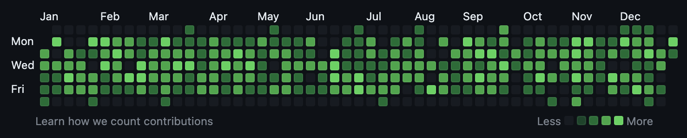

# Contribution Graph Filler

Fill out your contributions graph.



## Usage

1. Create a new private repository on GitHub
2. Ensure your contributions graph is configured to show private contributions
3. Clone this repository and run the following commands:

```bash
go run main.go <path/to/private/repository>
```
4. Push the generated commits to your private repository
